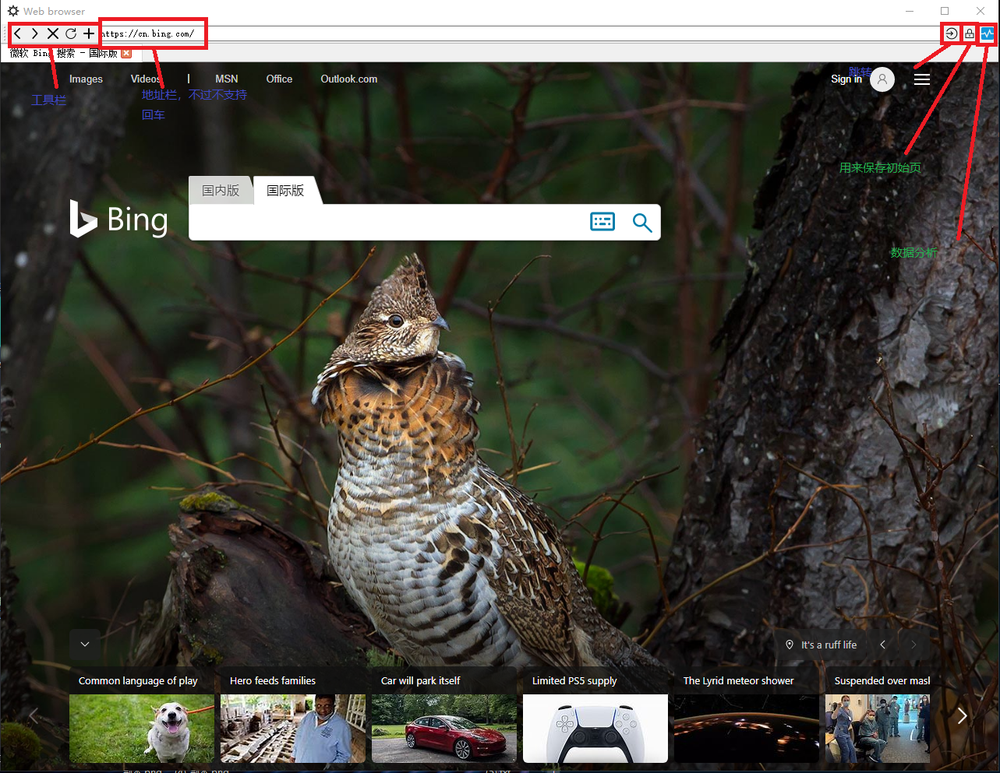
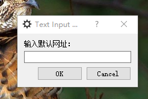
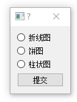
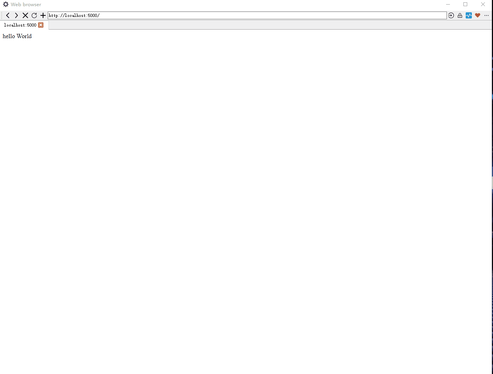

<!--
 * @lanhuage: python
 * @Descripttion: 
 * @version: beta
 * @Author: xiaoshuyui
 * @Date: 2020-04-16 15:40:01
 * @LastEditors: xiaoshuyui
 * @LastEditTime: 2020-04-21 15:36:30
 -->
# WebBrowser-python-pyqt5-14

## 2020.4.17 修改说明

# web browser

浏览器主框架是从 https://github.com/zxingwork/Py/tree/master/Webbrowser 抄来的，因为昨天我还不会pyqt。后来今天我会了一点，改了部分icon，添了很多代码，优化了（1）关闭网页的时候判断，如果只有一个网页的话会关掉新建一个默认网页，而不是不关闭 （2）添加设置默认网页的代码 （3）添加数据分析icon跟部分逻辑 （4）原先这个浏览器网址如果不是以"http(s)://"打头的话无法正常访问，这个也优化了 （5）打开的时候大小也算是优化了一下吧 ：）

learning PyQt5 ...

目标是能在这个浏览器上使用Seaborn画图

# 说明
## static文件夹是用来存储图片等静态资源
## utils是工具包
## LocalWebTest是本地服务器，用来测试用，Flask框架 
## details 文件夹是系统无关的演示图像

# 具体特性 

### 1.程序主界面

访问的是localhost:5000，服务器没有起，所以看不到东西

### 2.bing首页访问

看上去跟一般浏览器差不多，不过慢一点

### 3.可以修改初始页

### 4.使用xls/csv(没试过)读取数据

### 5.读文件，手动填表名

为什么这样设计，因为我懒

### 6.默认空白，就读取名为“Sheet1”的表

### 7.选择要分析的列——注意是列，竖着的

## 2020.4.20 修改说明

### 修改1

最右边多了一个 "..."符号，是测试用的按钮

### 修改2

flask后端更新 template，主要是展示seaborn数据图

### 修改3

这里我只能想到用get方法访问让前端页面显示，这里还没有把列选择跟数据类型图（折线图，饼图等等）结合起来。这里还需要说的是图片是经过base64转码传到前端的。因为google 浏览器不支持直接访问本地文件，而IE支持。

### 修改4

暂时支持以上几种图形，因为我只认识这几种。

### 修改5

地址栏支持回车访问啦啦啦啦啦~~~嗯，这很关键，之后会考虑编写右键事件——如果支持的话。

## 2020.4.21 修改说明

### 修改1

支持右键弹出QMenu，不好截图。

### 修改2

绘图前后端结合。屏幕录制的工具挺方便的 https://github.com/NickeManarin/ScreenToGif

### 修改3

添加历史记录以及地址栏自动补全功能，但是暂时没做到点击QCompleter之后的项能够跳转。参考的是 https://www.cnblogs.com/shiqi17/p/12176497.html

### 修改4

可以使用plt重新绘制（暂时只支持添加x,y轴label）图片

TODO:感觉可以把这个做在网页端，添加n个可变参数。